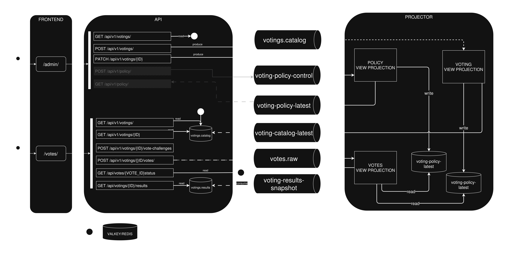
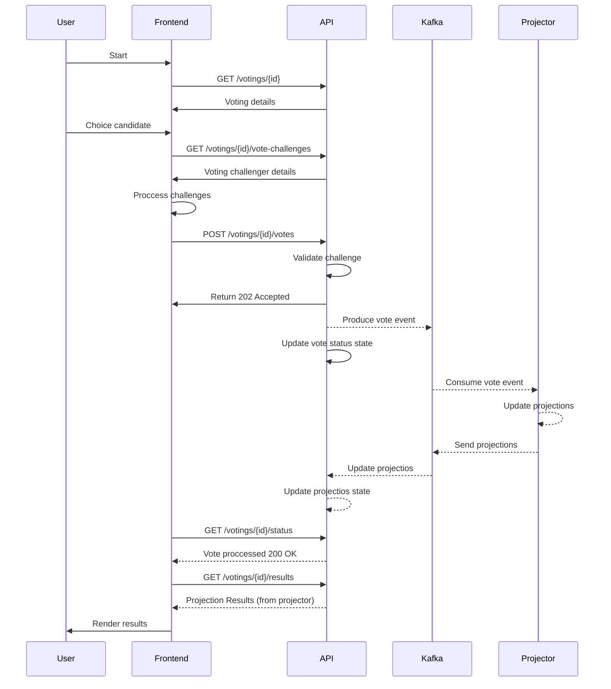

# Voting Platform

## What This Repo Shows

- event-driven voting platform with separate API, projector, and frontend services
- per-voting lifecycle management, vote submission, results projection, and IP blocking policies
- anti-abuse controls with honeypot, adaptive proof-of-work, edge rate limiting, and distributed challenge tracking
- observability with Prometheus plus three provisioned Grafana dashboards
- local runtime via Compose, INI-based config, and containerized Go tooling

## Benchmarks

### Load Test Results - 900 VUs Stress Test

| Metric | Value |
|--------|-------|
| **Virtual Users (VUs)** | 900 |
| **Request Rate (req/s)** | 16,591 |
| **Vote Cycles Rate (ops/s)** | 7,295 |
| **P95 Latency (HTTP)** | 78.55 ms |
| **P95 Latency (Iteration)** | 116.85 ms |
| **Fail Rate** | 0.00% |
| **Total Requests** | 6.49M |
| **Total Vote Cycles** | 3.24M |
| **Data Transferred** | ~3.8 GB |

The stress test with **900 Virtual Users** achieved **20,591 req/s** (10,295 vote cycles/s), with **0% failures** and P95 latency of **78.55ms**.

**Why two throughput metrics?** Each test iteration performs multiple HTTP requests.
- **req/s** = total HTTP requests per second (16,591)
- **vote cycles/s** = complete voting cycles per second (7,295)

The **vote cycles/s** metric is more representative of actual voting throughput, as it counts complete voting operations.

The event-driven architecture with Kafka demonstrates consistent horizontal scalability: throughput doubled proportionally with the VU increase (from 200 to 900), maintaining latency below 100ms at P95.

## Architecture

This project implements an event-driven voting platform based on CQRS (Command Query Responsibility Segregation) and Event Sourcing patterns. Write operations (vote submissions) are processed through the API and persisted as immutable events in Kafka topics, establishing a reliable event log with Log Compaction for efficient storage. The projector service consumes these events and builds Materialized Views that aggregate vote counts per candidate, providing optimized read paths for the results endpoint. This separation between command and query sides allows the system to handle high write throughput while maintaining consistent, eventually convergent read models.



### Components

#### Frontend
- **Port**: 3000
- **Purpose**: User interface for voting

#### API Server
- **Port**: 8080 (primary), 8082 (secondary)
- **Purpose**: Handles voting operations, vote registration, results
- **Dependencies**: Kafka

#### Projector
- **Port**: 8081
- **Purpose**: Projects vote results from Kafka topics
- **Dependencies**: Kafka

#### Kafka
- **Port**: 9092
- **Purpose**: Message broker for vote events

#### Observability Stack
| Service | Port | Purpose |
|---------|------|---------|
| Prometheus | 9090 | Metrics collection |
| Grafana | 3001 | Dashboards & visualization |
| Node Exporter | 9100 | System metrics |
| Kafka Exporter | 9308 | Kafka metrics |

#### Documentation
| Service | Port | Purpose |
|---------|------|---------|
| Swagger UI | 3003 | API documentation |

### Data Flow




### Security and anti-bot protection

#### 1. Rate limiting at edge layer by IP.
Rate limiting enforced at the API gateway or edge layer restricts how many requests an IP can make within a configurable time window. Uses algorithms like token bucket or sliding window to allow legitimate traffic while blocking abuse patterns. When a client exceeds the threshold, subsequent requests return 429 (Too Many Requests) with a Retry-After header. Configurable per-endpoint and per-voting to prevent targeted attacks on specific votings.

#### 2. Honeypot form mechanism to detect simple bots, blocks votes and creating custom policy to block future attacks.
Hidden form fields (CSS-hidden or programmatically-injected) are included in the vote form but never filled by human users. Bots typically auto-fill all visible fields. When a honeypot field contains a value, the submission is silently rejected or flagged. Detected bot IPs are automatically added to a blocklist that enforces custom policies (ranging from temporary rate limits to permanent IP bans) applied retroactively and prospectively.

#### 3. Slider submission, to registry movements and detect suspicious non-human movement patterns.
Instead of a simple button click, users must drag a slider from start to end position to submit their vote. The frontend captures mouse/touch movement data during the drag: velocity, acceleration, pauses, jitter, and path curvature. This behavioral biometric is analyzed to generate a human-score. Suspicious patterns (e.g., linear movement, constant velocity, no micro-corrections) trigger additional challenges or automatic flagging.

#### 4. PoW (Proof of Work) anti-abuse mechanism: force each vote submission to realize memory and CPU bound operation, exponentially increasing the cost of mass attacks.
Each vote submission requires solving a cryptographic puzzle before acceptance. The server issues a challenge (nonce) that the client must hash with a difficulty parameter. Supported algorithms include:
- Argon2: Memory-hard function resistant to GPU/ASIC acceleration
- Equihash: Wallet-style proof-of-work requiring significant memory
- Hashcash: Classic CPU-bound stamp (simpler, lower protection)
- Cuckoo Cycle: Graph-theoretic memory-hard proof
Difficulty can be dynamically adjusted based on detected attack patterns, normal traffic gets minimal PoW, suspicious IPs face exponentially harder puzzles. This makes mass-voting computationally and economically prohibitive while adding only ~100-500ms latency for legitimate users.

#### 5. Custom policies to filter suspicious votes.
A rule-engine evaluates votes against configurable policy conditions:
- IP reputation: block known bad actors, VPN/proxy exits
- Velocity checks: excessive votes per minute from same subnet
- Geographic anomalies: impossible travel detection
- Pattern matching: repeated candidate selections, timing fingerprints
- Historical behavior: cumulative abuse score per IP/subnet
Policies can trigger actions: allow, flag for review, soft-block (PoW challenge), or hard-block (immediate rejection).

#### 6. Post votes analysis: run asynchronous analysis on historical vote data, to detect anomalies and identify human and bot patterns, deriving custom rules to enforce anti-bot policies. The new policies can affect future votes, or acting on past saved votes.
After votes are stored, an async worker analyzes submitted data using:
- Statistical anomaly detection: Benford's law on vote distributions, outlier scoring
- Clustering: Grouping similar vote patterns (timing, IP proximity, form interaction)
- Behavioral profiling: Building human vs. bot signatures from historical data
- Machine learning classifiers: Training models on labeled datasets

Findings generate new policy rules that:
- Prospectively block similar future attacks
- Retroactively flag or invalidate past votes matching attack signatures
- Notify administrators of detected campaigns

## Fastest Review Path

If you only have a few minutes, run:

```bash
make dev
make verify
make smoke
```

Then open:

- vote UI: `http://localhost:3000/vote.html`
- admin UI: `http://localhost:3000/admin.html`
- direct API: `http://localhost:8080`
- Grafana: `http://localhost:3001`
- Prometheus: `http://localhost:9090`
- Kafka UI: `http://localhost:8085`

## Quick Start

### Starting the Stack

| Command | Description |
|---------|-------------|
| `make dev` | Start the stack using dev configuration (`configs/dev.env`) |
| `make prod` | Start the stack using production configuration (`configs/prod.env`) |
| `make benchmark` | Start the stack using benchmark configuration (`configs/benchmark.env`) |

### Configuration

| Command | Description |
|---------|-------------|
| `make config-dev` | Validate and select dev configuration |
| `make config-prod` | Validate and select production configuration |
| `make config-benchmark` | Validate and select benchmark configuration |
| `make print-env` | Display the currently loaded environment file contents |

### Controlling the Stack

| Command | Description |
|---------|-------------|
| `make up` | Start all services in detached mode |
| `make down` | Stop all services |
| `make restart` | Restart the entire stack (down + up) |
| `make rebuild` | Clean app images, rebuild without cache, and start |
| `make ps` | Show status of all running containers |
| `make status` | Alias for `make ps` |

### Logs

| Command | Description |
|---------|-------------|
| `make logs` | Tail all container logs |
| `make logs-api` | Tail API (primary + secondary) logs |
| `make logs-projector` | Tail projector service logs |
| `make logs-frontend` | Tail frontend service logs |
| `make logs-grafana` | Tail Grafana logs |

### Verification & Testing

| Command | Description |
|---------|-------------|
| `make verify` | Run full verification suite (fmt + test + contracts) |
| `make fmt` | Format Go code inside container |
| `make test` | Run Go unit tests inside container |
| `make contracts-check` | Validate YAML/JSON contract files |
| `make smoke` | Run Go integration tests |
| `make test-integration` | Run integration tests (excluding restart tests) |
| `make test-integration-full` | Run all integration tests including restart scenarios |
| `make test-ui` | Run Playwright UI tests |

### Observability

| Command | Description |
|---------|-------------|
| `make health` | Check health endpoints of key services |
| `make urls` | Print all service URLs for easy access |

### Load Testing

| Command | Description |
|---------|-------------|
| `make load-create-voting` | Create a voting for load testing |
| `make load-smoke` | Quick load test (smoke test) |
| `make load-sustained` | Sustained load test over time |
| `make load-spike` | Spike load test (burst traffic) |
| `make load-stress` | Stress test with 900 virtual users |
| `make load-consistency` | Test vote consistency under load |
| `make load-consistency-topic` | Consistency test with Kafka topic verification |

### Cleanup

| Command | Description |
|---------|-------------|
| `make clean-runtime` | Remove platform containers |
| `make clean-app-images` | Remove locally built application images |
| `make clean-go-cache` | Remove Go module and build cache |
| `make reset-runtime` | Full reset: down + clean containers + clean images |

## Folders structure

- `apps/api/`: HTTP API, vote ingestion, anti-abuse enforcement, snapshot consumption
- `apps/projector/`: event consumer that builds and republishes materialized result snapshots
- `apps/frontend/`: static frontend plus edge proxy behavior
- `contracts/`: HTTP, event, and topic contracts
- `deploy/`: Compose runtime plus observability assets
- `configs/`: INI profiles for local and production-oriented configuration
- `scripts/`: smoke, runtime, validation, and load-test helpers
- `tests/load/`: k6 scenarios and load-test docs

## Configuration Model

Profiles live in:

- `configs/dev.env`
- `configs/prod.env`
- `configs/benchmark.env`

You can override individual values after loading the env file.

## API Exposure Model

The intended deployment model is frontend edge to internal API.

Local Compose still exposes `:8080` and `:8082` on `127.0.0.1` for developer convenience. Optional edge hardening is available through:

- `API_EDGE_PROXY_SHARED_SECRET`
- `API_B_EDGE_PROXY_SHARED_SECRET`
- `FRONTEND_API_EDGE_AUTH_SECRET`
- `API_EDGE_PROXY_AUTH_HEADER`

When configured, normal API routes require the configured edge-auth header.

## CI Overview

GitHub Actions CI is defined in `.github/workflows/ci.yml`.

Current workflow coverage:

- contract validation
- semantic tag validation
- Go tests for `api` and `projector`
- image builds for `api`, `projector`, and `frontend`
- release asset packaging on semantic tags
