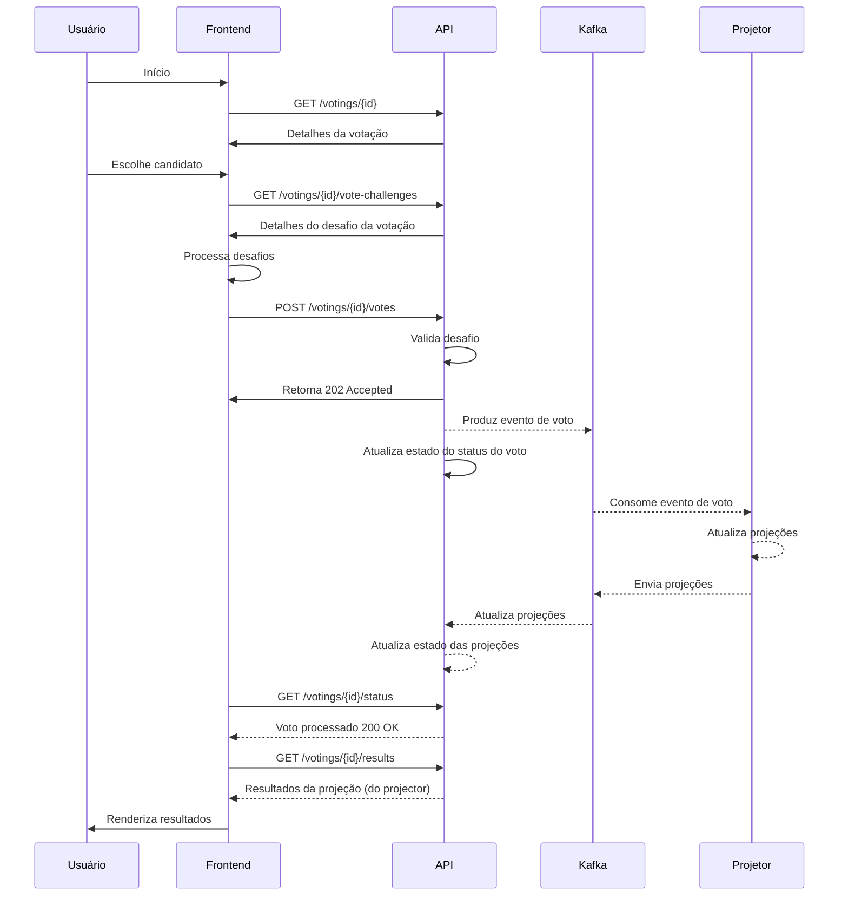

# Plataforma de Votação

## O que este repositório demonstra

- plataforma de votação orientada a eventos, com serviços separados de API, projetor e frontend
- gerenciamento do ciclo de vida por votação, submissão de votos, projeção de resultados e políticas de bloqueio por IP
- controles antiabuso com honeypot, proof-of-work adaptativo, rate limiting na borda e rastreamento distribuído de desafios
- observabilidade com Prometheus e três dashboards do Grafana já provisionados
- execução local via Compose, configuração baseada em arquivos INI e toolchain Go containerizada

## Benchmarks

### Resultados de teste de carga — stress test com 900 VUs

| Métrica | Valor |
|--------|-------|
| **Usuários Virtuais (VUs)** | 900 |
| **Taxa de Requisições (req/s)** | 16.591 |
| **Taxa de Ciclos de Votação (ops/s)** | 7.295 |
| **Latência P95 (HTTP)** | 78,55 ms |
| **Latência P95 (Iteração)** | 116,85 ms |
| **Taxa de Falha** | 0,00% |
| **Total de Requisições** | 6,49M |
| **Total de Ciclos de Votação** | 3,24M |
| **Dados Transferidos** | ~3,8 GB |

O teste de estresse com **900 Usuários Virtuais** alcançou **20.591 req/s** (10.295 ciclos de votação/s), com **0% de falhas** e latência P95 de **78,55 ms**.

**Por que existem duas métricas de throughput?** Cada iteração do teste executa múltiplas requisições HTTP.
- **req/s** = total de requisições HTTP por segundo (16.591)
- **ciclos de votação/s** = ciclos completos de votação por segundo (7.295)

A métrica de **ciclos de votação/s** é mais representativa do throughput real de votação, pois contabiliza operações de votação completas.

A arquitetura orientada a eventos com Kafka demonstra escalabilidade horizontal consistente: o throughput dobrou proporcionalmente com o aumento de VUs (de 200 para 900), mantendo a latência abaixo de 100 ms no P95.

## Arquitetura

Este projeto implementa uma plataforma de votação orientada a eventos com base nos padrões CQRS (Command Query Responsibility Segregation) e Event Sourcing. As operações de escrita (submissão de votos) são processadas pela API e persistidas como eventos imutáveis em tópicos do Kafka, estabelecendo um event log confiável com Log Compaction para armazenamento eficiente. O serviço projector consome esses eventos e constrói Materialized Views que agregam a contagem de votos por candidato, fornecendo caminhos de leitura otimizados para o endpoint de resultados. Essa separação entre os lados de comando e consulta permite que o sistema suporte alta taxa de escrita, ao mesmo tempo em que mantém modelos de leitura consistentes e eventualmente convergentes.

### Componentes

#### Frontend
- **Porta**: 3000
- **Propósito**: Interface do usuário para votação

#### Servidor de API
- **Porta**: 8080 (primária), 8082 (secundária)
- **Propósito**: Gerencia operações de votação, registro de votos e resultados
- **Dependências**: Kafka

#### Projetor
- **Porta**: 8081
- **Propósito**: Projeta resultados de votação a partir de tópicos do Kafka
- **Dependências**: Kafka

#### Kafka
- **Porta**: 9092
- **Propósito**: Broker de mensagens para eventos de votação

#### Stack de Observabilidade
| Serviço | Porta | Propósito |
|---------|------|---------|
| Prometheus | 9090 | Coleta de métricas |
| Grafana | 3001 | Dashboards e visualização |
| Node Exporter | 9100 | Métricas do sistema |
| Kafka Exporter | 9308 | Métricas do Kafka |

#### Documentação
| Serviço | Porta | Propósito |
|---------|------|---------|
| Swagger UI | 3003 | Documentação da API |

### Fluxo de Dados

### Segurança e proteção anti-bot

#### 1. Rate limiting na camada de borda por IP.
O rate limiting, aplicado no gateway da API ou na camada de borda, restringe quantas requisições um IP pode fazer dentro de uma janela de tempo configurável. Ele usa algoritmos como token bucket ou sliding window para permitir tráfego legítimo enquanto bloqueia padrões de abuso. Quando um cliente excede o limite, as requisições subsequentes retornam 429 (Too Many Requests) com o header Retry-After. Pode ser configurado por endpoint e por votação para impedir ataques direcionados a votações específicas.

#### 2. Mecanismo de honeypot no formulário para detectar bots simples, bloquear votos e criar política customizada para bloquear ataques futuros.
Campos ocultos no formulário (escondidos por CSS ou injetados programaticamente) são incluídos no formulário de voto, mas nunca são preenchidos por usuários humanos. Bots normalmente preenchem automaticamente todos os campos visíveis. Quando um campo honeypot contém valor, a submissão é rejeitada silenciosamente ou marcada como suspeita. Os IPs detectados como bots são automaticamente adicionados a uma blocklist que aplica políticas customizadas (variando de rate limiting temporário a banimento permanente de IP), com efeito retroativo e prospectivo.

#### 3. Submissão por slider, para registrar movimentos e detectar padrões suspeitos de movimentação não humana.
Em vez de um simples clique em botão, o usuário precisa arrastar um slider da posição inicial até a final para submeter seu voto. O frontend captura dados de movimento do mouse/toque durante o arrasto: velocidade, aceleração, pausas, jitter e curvatura do trajeto. Essa biometria comportamental é analisada para gerar uma pontuação de humanidade. Padrões suspeitos (por exemplo, movimento linear, velocidade constante, ausência de microcorreções) disparam desafios adicionais ou marcação automática.

#### 4. Mecanismo antiabuso com PoW (Proof of Work): força cada submissão de voto a executar uma operação custosa em memória e CPU, aumentando exponencialmente o custo de ataques em massa.
Cada submissão de voto exige a resolução de um quebra-cabeça criptográfico antes da aceitação. O servidor emite um desafio (nonce) que o cliente precisa hashear com um parâmetro de dificuldade. Os algoritmos suportados incluem:
- Argon2: função memory-hard resistente a aceleração por GPU/ASIC
- Equihash: proof-of-work no estilo wallet, com uso significativo de memória
- Hashcash: stamp clássico CPU-bound (mais simples, menor proteção)
- Cuckoo Cycle: prova memory-hard baseada em grafos

A dificuldade pode ser ajustada dinamicamente com base em padrões de ataque detectados: tráfego normal recebe PoW mínimo, enquanto IPs suspeitos enfrentam quebra-cabeças exponencialmente mais difíceis. Isso torna a votação em massa computacionalmente e economicamente proibitiva, adicionando apenas ~100–500 ms de latência para usuários legítimos.

#### 5. Políticas customizadas para filtrar votos suspeitos.
Um rule engine avalia votos com base em condições de política configuráveis:
- reputação de IP: bloqueio de atores maliciosos conhecidos, saídas de VPN/proxy
- verificações de velocidade: excesso de votos por minuto vindos da mesma subnet
- anomalias geográficas: detecção de deslocamento impossível
- pattern matching: seleções repetidas de candidatos, impressões temporais
- comportamento histórico: score acumulado de abuso por IP/subnet

As políticas podem disparar ações como: permitir, marcar para revisão, bloqueio leve (desafio PoW) ou bloqueio rígido (rejeição imediata).

#### 6. Análise posterior dos votos: executar análise assíncrona sobre o histórico de votos para detectar anomalias e identificar padrões humanos e de bots, derivando regras customizadas para reforçar políticas anti-bot. As novas políticas podem afetar votos futuros ou agir sobre votos já salvos.
Após os votos serem armazenados, um worker assíncrono analisa os dados submetidos usando:
- detecção estatística de anomalias: lei de Benford sobre distribuições de votos, outlier scoring
- clustering: agrupamento de padrões de voto semelhantes (tempo, proximidade de IP, interação com o formulário)
- behavioral profiling: construção de assinaturas de comportamento humano vs. bot a partir do histórico
- classificadores de machine learning: treinamento de modelos com datasets rotulados

As descobertas geram novas regras de política que:
- bloqueiam prospectivamente ataques futuros semelhantes
- marcam ou invalidam retroativamente votos passados que correspondam a assinaturas de ataque
- notificam administradores sobre campanhas detectadas

## Início Rápido

### Iniciando a stack

| Comando | Descrição |
|---------|-------------|
| `make dev` | Inicia a stack usando a configuração de desenvolvimento (`configs/dev.env`) |
| `make prod` | Inicia a stack usando a configuração de produção (`configs/prod.env`) |
| `make benchmark` | Inicia a stack usando a configuração de benchmark (`configs/benchmark.env`) |

### Configuração

| Comando | Descrição |
|---------|-------------|
| `make config-dev` | Valida e seleciona a configuração de desenvolvimento |
| `make config-prod` | Valida e seleciona a configuração de produção |
| `make config-benchmark` | Valida e seleciona a configuração de benchmark |
| `make print-env` | Exibe o conteúdo do arquivo de ambiente atualmente carregado |

### Controle da stack

| Comando | Descrição |
|---------|-------------|
| `make up` | Inicia todos os serviços em modo detached |
| `make down` | Para todos os serviços |
| `make restart` | Reinicia toda a stack (down + up) |
| `make rebuild` | Limpa as imagens da aplicação, recompila sem cache e inicia |
| `make ps` | Mostra o status de todos os containers em execução |
| `make status` | Alias para `make ps` |

### Logs

| Comando | Descrição |
|---------|-------------|
| `make logs` | Acompanha os logs de todos os containers |
| `make logs-api` | Acompanha os logs da API (primária + secundária) |
| `make logs-projector` | Acompanha os logs do serviço projector |
| `make logs-frontend` | Acompanha os logs do serviço frontend |
| `make logs-grafana` | Acompanha os logs do Grafana |

### Verificação e testes

| Comando | Descrição |
|---------|-------------|
| `make verify` | Executa a suíte completa de verificação (fmt + test + contracts) |
| `make fmt` | Formata o código Go dentro do container |
| `make test` | Executa os testes unitários em Go dentro do container |
| `make contracts-check` | Valida arquivos de contrato YAML/JSON |
| `make smoke` | Executa testes de integração em Go |
| `make test-integration` | Executa testes de integração (excluindo cenários de restart) |
| `make test-integration-full` | Executa todos os testes de integração, incluindo cenários de restart |
| `make test-ui` | Executa testes de UI com Playwright |

### Observabilidade

| Comando | Descrição |
|---------|-------------|
| `make health` | Verifica os endpoints de health dos principais serviços |
| `make urls` | Exibe todas as URLs dos serviços para acesso rápido |

### Testes de carga

| Comando | Descrição |
|---------|-------------|
| `make load-create-voting` | Cria uma votação para testes de carga |
| `make load-smoke` | Teste de carga rápido (smoke test) |
| `make load-sustained` | Teste de carga sustentada ao longo do tempo |
| `make load-spike` | Teste de carga em pico (burst traffic) |
| `make load-stress` | Stress test com 900 usuários virtuais |
| `make load-consistency` | Testa a consistência dos votos sob carga |
| `make load-consistency-topic` | Teste de consistência com verificação do tópico Kafka |

### Limpeza

| Comando | Descrição |
|---------|-------------|
| `make clean-runtime` | Remove os containers da plataforma |
| `make clean-app-images` | Remove as imagens da aplicação construídas localmente |
| `make clean-go-cache` | Remove o cache de módulos e build do Go |
| `make reset-runtime` | Reset completo: down + limpeza de containers + limpeza de imagens |

## Estrutura de pastas

- `apps/api/`: API HTTP, ingestão de votos, aplicação das regras antiabuso, consumo de snapshots
- `apps/projector/`: consumidor de eventos que constrói e republica snapshots materializados de resultados
- `apps/frontend/`: frontend estático com comportamento de proxy de borda
- `contracts/`: contratos HTTP, de eventos e de tópicos
- `deploy/`: runtime Compose e assets de observabilidade
- `configs/`: perfis INI para configuração local e orientada a produção
- `scripts/`: helpers para smoke, runtime, validação e testes de carga
- `tests/load/`: cenários k6 e documentação de testes de carga

## Modelo de configuração

Os perfis ficam em:

- `configs/dev.env`
- `configs/prod.env`
- `configs/benchmark.env`

Você pode sobrescrever valores individuais após carregar o arquivo de ambiente.

## Modelo de exposição da API

O modelo de deploy pretendido é frontend de borda para API interna.

O Compose local ainda expõe `:8080` e `:8082` em `127.0.0.1` por conveniência para desenvolvimento. O endurecimento opcional da borda está disponível por meio de:

- `API_EDGE_PROXY_SHARED_SECRET`
- `API_B_EDGE_PROXY_SHARED_SECRET`
- `FRONTEND_API_EDGE_AUTH_SECRET`
- `API_EDGE_PROXY_AUTH_HEADER`

Quando configurado, as rotas normais da API exigem o header de autenticação de borda configurado.

## Visão geral da CI

O GitHub Actions CI está definido em `.github/workflows/ci.yml`.

Cobertura atual do workflow:

- validação de contratos
- validação de tags semânticas
- testes Go para `api` e `projector`
- builds de imagem para `api`, `projector` e `frontend`
- empacotamento de release assets em tags semânticas
